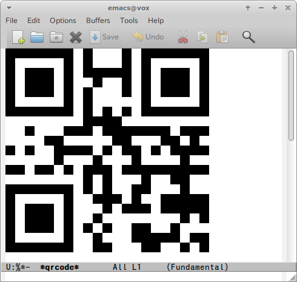

# qrcode.el

## Introduction

QR code for Emacs. This is also work no window environment(`emacs -nw`).

## Screenshot




## Requirements

- Emacs 24 or higher
- Go
- Go's [qr](https://godoc.org/code.google.com/p/rsc/qr) library


```
% go get code.google.com/p/rsc/qr
```

## Basic Usage

#### `M-x qrcode`

Encode string to QR code.

#### `M-x qrcode-region`

Encode region of string to QR code.
